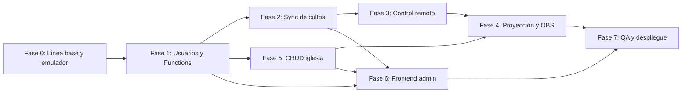

# Plan de Acción y Correcciones — CGID (v1 / v2)

> **Rama de trabajo:** `fix_bugs_and_planning` (derivada de `dev-v2`)
> **Fecha:** 5 de octubre de 2026
> **Prioridad:** Backend (Firebase: Auth, Firestore, reglas, funciones) → Integración → Frontend
> **Alcance:** conectividad, proyección, transmisión, sincronización de cultos, CRUD del admin y permisos por rol.

---

## 0. Contexto: las dos versiones

| | v1 (producción estable) | v2 (en estabilización) |
|---|---|---|
| Rama | `master` | `dev-v2` |
| Versión | `1.0.0+15` | `2.0.0+21` |
| Hosting | GitHub Pages + espejo `cgid-4c078.web.app` | `cgdi-app-v2.web.app` |
| Proyecto Firebase | `cgid-4c078` | `cgdi-app-v2` |
| Backend | Firestore/Auth mínimos | Auth + Firestore multi-iglesia, roles, control remoto en nube |

**Reglas de trabajo:**
1. Todas las correcciones se hacen sobre v2 (`dev-v2`). En v1 solo se aplican *hotfixes* críticos con *cherry-pick* explícito.
2. Ningún cambio de reglas o funciones se publica en `cgdi-app-v2` sin pasar antes por el **Emulator Suite**.
3. Observación: `master` usa versiones de Firebase más nuevas que `dev-v2` (`firebase_core ^4.15` vs `^4.7`). Se alinea en la Fase 1.

---

## 1. Hallazgos de la revisión de código (causa raíz)

### 1.1 Usuarios y CRUD del admin
| # | Hallazgo | Ubicación | Impacto |
|---|---|---|---|
| U1 | `deleteUser()` solo borra `users/{uid}`. **La cuenta de Firebase Auth nunca se elimina** (el cliente no puede borrar a otro usuario). | `user_profile_provider.dart` L230-232 | Es el error reportado: el usuario sigue en *Authentication* y su correo queda "ocupado". |
| U2 | Al re-registrar un correo eliminado, `createUserWithEmailAndPassword` falla con `email-already-in-use`; el código lo ignora y crea solo una invitación. **La contraseña nueva que puso el admin se descarta en silencio** y la vieja sigue válida. | `user_profile_provider.dart` L115-186 | Confusión, accesos con contraseñas antiguas. |
| U3 | `setPasswordForPastor()` crea cuentas Auth **sin perfil** en Firestore (cuentas huérfanas). | L189-221 | Cuentas fantasma. |
| U4 | Las invitaciones pendientes (`account_invitations`) **no se listan ni se pueden eliminar/editar** desde la UI; `allUsersProvider` solo consulta `users`. | `user_profile_provider.dart` L45-74, `pastor_assignment_dialog.dart` | Invitaciones "zombis" que permiten activar cuentas después de "borrarlas". |
| U5 | Se puede asignar rol `pastor` sin `churchId`; ese pastor ve todo vacío y no puede escribir. | `updateUserRole` L223 | Roles inconsistentes. |
| U6 | No hay protección contra que un admin se quite su propio rol o borre al último admin. | Admin dashboard | Pérdida de acceso administrativo. |
| U7 | `allUsersProvider` es un `FutureProvider` (no en tiempo real); depende de `invalidate` manual. | L45 | La lista puede quedar desactualizada entre pestañas/dispositivos. |

### 1.2 Sincronización de cultos
| # | Hallazgo | Ubicación | Impacto |
|---|---|---|---|
| S1 | `syncToCloud` hace `batch.set` **sin merge** del documento completo `weekly_plans`: el dispositivo que sube **sobrescribe todos los cultos** de la iglesia con su copia local. | `plan_provider.dart` L84-122 | Pérdida de cultos creados por otro editor. |
| S2 | `fetchFromCloud` **reemplaza** los planes locales; los planes que solo existían localmente se pierden. | L124-192 | Pérdida de trabajo local. |
| S3 | Sincronización 100% manual (subir/bajar). No hay *listener* en tiempo real: el proyeccionista no ve cambios del pastor hasta pulsar "descargar". | `plan_provider.dart` | Rompe el flujo pastor → cabina. |
| S4 | Todos los cultos viven en **un solo documento** (`plans/weekly_plans`) → límite de 1 MiB, contención de escrituras y límite de 100 planes. | Modelo + `firestore.rules` L128-135 | Fallos al crecer. |
| S5 | Notas privadas se emparejan por **índice** con las entradas públicas; si se reordena el culto, las notas quedan en el elemento equivocado. | `_mergePrivateNotes` L314-342 | Notas ministeriales desalineadas. |
| S6 | Sin control de versión/conflictos (`revision`, `updatedBy`). | — | Carreras entre dos editores. |

### 1.3 Control remoto / conectividad
| # | Hallazgo | Ubicación | Impacto |
|---|---|---|---|
| R1 | `publishState` y `closeSession` **tragan todos los errores** (`catch (_) {}`). Si las reglas rechazan el esquema, la sesión nunca se crea y el celular muestra "desconectado" sin diagnóstico. | `cloud_remote_bridge.dart` L42-51, L79-83 | Fallas silenciosas de emparejamiento. |
| R2 | Un solo campo `lastCommand`: pulsaciones rápidas se **sobrescriben** y se pierden comandos. | L87-102 | Saltos de diapositiva perdidos. |
| R3 | Al reconectar, el host procesa de nuevo el último `lastCommand` almacenado (`lastProcessedCmdId` arranca en `null`). | L60-74 | Avance fantasma al abrir sesión. |
| R4 | `publishState` se llama en **cada** `syncOutput` (cada diapositiva) con `planItems` completos → escrituras excesivas (costo y latencia). | `workspace.dart` L490-501 | Lentitud y costo. |
| R5 | **Fuga de notas privadas:** `planItems[].notes` y `currentNotes` se publican en `remote_sessions`, legible por cualquiera con el código. | `workspace.dart` L196-221 | Exposición de notas ministeriales. |
| R6 | Las sesiones nunca se borran (`allow delete: if false`) y no hay política TTL → acumulación indefinida con contenido. | `firestore.rules` L420-441 | Datos residuales. |
| R7 | Conversiones frágiles: `cmd is Map<String,dynamic>` y `payload['index'] as int?` pueden fallar en web/wasm (mapas JS, números `double`). | `cloud_remote_bridge.dart` L66-71, `workspace.dart` L1637 | Comandos ignorados en algunos navegadores. |
| R8 | El puente nube solo se activa en `kIsWeb`; en escritorio se usa el servidor HTTP local. Dos rutas de código con lógica duplicada de comandos. | `workspace.dart` L150-183 y L1600-1658 | Comportamiento divergente. |

### 1.4 Proyección y transmisión
| # | Hallazgo | Ubicación | Impacto |
|---|---|---|---|
| P1 | **Doble fuente de verdad:** `workspace.dart` mantiene su propio `slides/slideIndex/blackout/outputState` y existe además `projectionProvider` con la misma lógica. | `workspace.dart` L461-541, `projection_provider.dart` | Desincronización entre pantallas que usan uno u otro. |
| P2 | En web, la salida usa `BroadcastChannel` (mismo navegador y mismo origen). **OBS Browser Source es otro proceso → nunca recibe datos** en `/overlay`, `/lowerthirds` desde la versión web. | `projection_web.dart` L7, L111-114 | Overlays de transmisión vacíos. |
| P3 | `openOutput/openStage/openOverlay` reasignan `_channel.onmessage`; `listenOutput` devuelve un *dispose* vacío (no libera el listener). | `projection_web.dart` L27-90 | Fugas y handshakes que no responden. |
| P4 | Se envía la imagen en base64 en cada cambio de diapositiva. | `outputState` | Lag en proyección con imágenes. |
| P5 | Audio de bajo ancho de banda: el reproductor existe pero **no hay origen de streaming**; la URL se guarda solo en `SharedPreferences` del dispositivo. | `low_bandwidth_audio_provider.dart`, `tenant_provider.dart` L38 | Función no operativa para la congregación. |

### 1.5 Datos de iglesia (CRUD inexistente en la nube)
| # | Hallazgo | Ubicación | Impacto |
|---|---|---|---|
| T1 | Iglesias, horarios y enlaces de Meet se leen de un **asset empaquetado** (`assets/data/regions_and_churches.json`). No hay CRUD real. | `tenant_provider.dart` L19-53 | Cambiar un horario requiere recompilar y publicar. |
| T2 | **Los avisos del pastor se guardan solo en `SharedPreferences` local** → la congregación nunca los ve. | `notices_editor_screen.dart` L31-47 | El editor de avisos no publica nada. |
| T3 | `churches/{id}` solo es escribible por admin; un pastor no puede actualizar Meet/horarios/audio de su propia iglesia. | `firestore.rules` L367-371 | Dependencia total del admin. |

### 1.6 Seguridad / configuración
| # | Hallazgo | Impacto |
|---|---|---|
| X1 | Correo del admin inicial *hardcodeado* en 3 lugares (reglas, `auth_provider`, `user_profile_provider`). | Difícil de rotar; mejor con *custom claims*. |
| X2 | Los roles se leen con `get()` en cada regla (varias lecturas por operación). | Costo y latencia; migrar a *custom claims*. |
| X3 | `firebase_vertexai` está deprecado (reemplazo: `firebase_ai`). | Riesgo de ruptura futura. |
| X4 | La auditoría previa pide rotar la API Key de Drive filtrada en el historial. | Pendiente operativo. |

---

## 2. Fases de trabajo

### FASE 0 — Línea base y entorno de pruebas (1–2 días)
**Objetivo:** reproducir cada falla antes de tocar código.

- [ ] Inicializar **Firebase Emulator Suite** (Auth, Firestore, Functions) y documentar `firebase emulators:start`.
- [ ] Crear *seed* del emulador: 2 iglesias, 1 admin, 2 pastores, 1 colaborador, 1 proyeccionista, 1 músico, 1 invitación pendiente.
- [ ] Comparar reglas **desplegadas** en `cgdi-app-v2` vs `firestore.rules` local (la auditoría indica que había reglas pendientes de publicar).
- [ ] Reproducir U1 y documentar: usuario visible en *Authentication* tras borrarlo.
- [ ] Ejecutar `flutter analyze` y `flutter test` como base; registrar resultados.
- [ ] Alinear versiones de paquetes Firebase con `master` y verificar que compila.

**Criterio de salida:** emulador funcional con datos semilla y lista de fallas reproducidas.

---

### FASE 1 — Backend: usuarios, roles y Cloud Functions (prioridad máxima)
**Resuelve:** U1–U7, X1, X2.

1. **Crear `functions/`** (TypeScript, Functions v2, región `us-central1` o la más cercana) con Admin SDK.
2. **Funciones invocables** (validan rol del invocador en servidor):
   | Función | Descripción |
   |---|---|
   | `adminCreateUser` | Crea cuenta Auth + perfil en una sola operación; si el correo ya existe en Auth, **actualiza contraseña** (admin) y crea/actualiza perfil. Elimina invitación previa. |
   | `adminDeleteUser` | Borra **Auth + `users/{uid}` + invitación** del mismo correo; revoca *refresh tokens*. Pastor solo puede borrar roles ministeriales de su iglesia. Impide borrar al último admin o a sí mismo. |
   | `adminSetPassword` | Cambia contraseña vía Admin SDK (reemplaza el truco de la app temporal). |
   | `adminUpdateRole` | Valida coherencia (pastor/colaborador/proyeccionista/músico **requieren `churchId`**) y actualiza *custom claims*. |
   | `deleteInvitation` | Elimina invitaciones pendientes. |
3. **Trigger de respaldo** `onDocumentDeleted('users/{uid}')` → elimina la cuenta Auth si aún existe (cubre borrados desde consola).
4. **Trigger** `beforeUserCreated`/`onUserCreated` opcional para consumir invitaciones en servidor.
5. **Custom claims** `{ role, churchId }` sincronizados desde el perfil; reglas leen `request.auth.token.role` (menos lecturas, más rápido). Mantener el perfil como fuente de verdad.
6. **Reglas:** bloquear `delete` directo de `users` desde cliente (solo vía función) y bloquear cambios de `role`/`churchId` desde cliente salvo por funciones.
7. **Script de migración:** limpiar cuentas Auth huérfanas (sin perfil ni invitación) con reporte previo y confirmación manual.
8. Mover el correo del admin inicial a configuración (parámetro de Functions / claim), quitarlo del código cliente.

**Pruebas (emulador):** crear, re-crear tras borrar, cambiar contraseña, cambiar rol, borrar por admin, borrar por pastor (permitido/denegado), pastor de iglesia A contra iglesia B.

**Criterio de salida:** al eliminar un usuario desaparece de *Authentication* y de Firestore; el mismo correo puede registrarse de nuevo con contraseña nueva.

---

### FASE 2 — Backend: sincronización de cultos
**Resuelve:** S1–S6.

1. **Nuevo modelo:** un documento por culto `churches/{churchId}/plans/{planId}` con:
   `title, date, entries[], metadata, revision (int), updatedAt, updatedBy`.
   Notas privadas en `churches/{churchId}/private_plans/{planId}` con notas **por `entryId`** (no por índice).
2. **Escrituras con transacción** y control optimista: si `revision` en la nube ≠ revisión local, no sobrescribir; avisar al usuario y ofrecer *Recargar / Sobrescribir / Duplicar*.
3. **Listener en tiempo real** (`snapshots()`) en proyección y cabina: los cambios del pastor llegan sin pulsar "descargar".
4. **Persistencia offline** de Firestore habilitada (web: `persistentLocalCache`) para que la cabina funcione sin red.
5. **Migración**: script que convierte `weekly_plans` (documento único) al modelo por culto, conservando notas; mantener lectura del formato viejo durante una versión.
6. **Borrado de cultos**: elimina plan público + privado juntos (batch).
7. Actualizar reglas: validación de esquema por culto, `revision` incremental, `updatedBy == request.auth.uid`.

**Criterio de salida:** dos dispositivos editan cultos distintos sin pisarse; un conflicto en el mismo culto se detecta; el proyeccionista ve el cambio en < 3 s.

---

### FASE 3 — Conectividad: control remoto
**Resuelve:** R1–R8.

1. **Separar estado y comandos:**
   - `remote_sessions/{id}` → solo estado público mínimo (título, etiqueta, texto, índice, total, blackout, lista de títulos **sin notas**).
   - `remote_sessions/{id}/commands/{cmdId}` → cola de comandos (append-only). El host procesa en orden y borra/marca cada comando. Elimina pérdidas (R2) y repeticiones (R3).
2. **Notas privadas en el remoto:** solo si el celular está autenticado como miembro de la iglesia, leyéndolas desde `private_plans` (no desde la sesión).
3. **Throttling** de `publishState` (máx. 1 escritura cada ~250 ms y solo si cambió el contenido); `planItems` solo cuando cambia el culto.
4. **Errores visibles:** reemplazar `catch (_) {}` por registro + indicador en UI ("Sesión no publicada: permisos/esquema").
5. **Parseo robusto:** convertir mapas con `Map<String, dynamic>.from(...)` y números con `(x as num?)?.toInt()`.
6. **Ciclo de vida:** TTL de Firestore sobre `expiresAt`; permitir `delete` al host; función programada que limpie sesiones expiradas.
7. **Unificar** el manejo de comandos (HTTP local y nube) en un solo `RemoteCommandHandler` reutilizado por ambos transportes.
8. **Reconexión:** indicador de estado (conectado / reconectando / caducado) en host y celular; renovación de `expiresAt` mientras el host siga activo.

**Criterio de salida:** 50 pulsaciones rápidas desde el celular = 50 movimientos en el proyector; ninguna nota privada en `remote_sessions`; latencia < 500 ms en red normal.

---

### FASE 4 — Proyección y transmisión
**Resuelve:** P1–P5.

1. **Una sola fuente de verdad:** migrar el estado de proyección de `workspace.dart` a `projectionProvider` (Riverpod). Todas las pantallas (proyector, monitor de escenario, overlay, dock OBS, remoto) leen de ahí.
2. **Transporte de salida para OBS:**
   - Mismo navegador → `BroadcastChannel` (actual).
   - OBS / otro equipo → overlay suscrito a `remote_sessions/{id}` (URL `/overlay?session=XXXX`) o al servidor local en escritorio.
   - Documentar en la UI qué URL copiar en OBS según la plataforma.
3. **Corregir `projection_web.dart`:** un único manejador de mensajes, `listenOutput` que realmente libere el listener, handshake de reconexión al recargar la ventana del proyector.
4. **Imágenes:** enviar `mediaId` y cachear en la ventana receptora en lugar de base64 en cada diapositiva.
5. **Audio de bajo ancho de banda:** definir origen (recomendado: Icecast/AzuraCast con Opus/AAC 32–48 kbps, o stream de YouTube solo-audio) y guardar `audioStreamUrl` en `churches/{id}` (Fase 5). Monitoreo básico (comprobación de disponibilidad del stream).
6. **Validación física:** OBS real (Browser Source), proyector HDMI, monitor de escenario, pérdida de red durante proyección.

**Criterio de salida:** el overlay en OBS muestra la letra en vivo; proyector, escenario y overlay siempre muestran la misma diapositiva.

---

### FASE 5 — CRUD de datos de iglesia en la nube
**Resuelve:** T1–T3.

1. **Colecciones:**
   - `regions/{regionId}` (admin).
   - `churches/{churchId}`: datos, horarios (`weeklyServices`), `defaultMeetUrl`, `audioStreamUrl`.
   - `churches/{churchId}/notices/{noticeId}`: avisos con `title, body, startsAt, endsAt, createdBy`.
   - `events/{eventId}` con `scope` (nacional/regional/local), `regionId`, `churchId`.
2. **Reglas por rol:**
   | Recurso | Admin | Pastor (su iglesia) | Colaborador | Proyeccionista / Músico | Público |
   |---|---|---|---|---|---|
   | Regiones | CRUD | Leer | Leer | Leer | Leer |
   | Iglesia (datos/horarios/Meet/audio) | CRUD | Editar campos operativos | Leer | Leer | Leer |
   | Avisos | CRUD | CRUD | CRUD | Leer | Leer |
   | Eventos locales | CRUD | CRUD | Crear/editar | Leer | Leer |
   | Eventos regionales/nacionales | CRUD | Leer | Leer | Leer | Leer |
   | Cultos (público) | CRUD | CRUD | CRUD | Leer | Leer |
   | Notas privadas | CRUD | CRUD | CRUD | Leer | — |
   | Usuarios | CRUD (vía funciones) | Roles ministeriales de su iglesia | — | — | — |
3. **Migración:** importar `regions_and_churches.json` a Firestore; el asset queda como respaldo offline.
4. `tenantProvider` lee de Firestore con caché offline y *fallback* al asset.
5. Editor de avisos escribe en Firestore (migrando los avisos locales existentes en el primer guardado).

**Criterio de salida:** un pastor cambia el enlace de Meet o publica un aviso y aparece en el celular de un miembro sin recompilar la app.

---

### FASE 6 — Frontend: admin y experiencia por rol
1. **Panel de usuarios:** lista en tiempo real (`StreamProvider`) de **usuarios + invitaciones pendientes** (con etiqueta), con acciones: reenviar, editar, eliminar invitación.
2. Botones de crear/borrar/cambiar rol/contraseña llaman a las **Cloud Functions** de la Fase 1; mensajes de error claros (sin `Exception: ...` crudo).
3. Validaciones en formularios: rol que requiere iglesia → selector obligatorio; confirmación reforzada para borrar admins.
4. **Navegación por rol:** ocultar acciones no permitidas (p. ej., proyeccionista sin "Subir culto"; músico directo al atril).
5. **Indicadores de sincronización** en cultos: *Guardado local / Sincronizando / Sincronizado / Conflicto*.
6. Presidente y predicador como asignaciones **por culto** (ya modelado); verificar que el selector use usuarios de la iglesia.
7. Reducir `workspace.dart` (3,572 líneas): extraer proyección, control remoto y gestión de cultos a sus *features*.
8. Pantallas de error/vacío consistentes y estados de carga en todo el admin.

---

### FASE 7 — QA, seguridad y despliegue
1. **Pruebas de reglas** (`@firebase/rules-unit-testing`) para cada celda de la matriz de la Fase 5 y aislamiento entre iglesias.
2. **Pruebas de Functions** en emulador (creación, borrado, re-registro, último admin).
3. **Pruebas Flutter:** unitarias de `PlanNotifier` (merge/conflictos), parseo de comandos remotos, `RemoteCommandHandler`; widget tests del panel de usuarios.
4. **Integración E2E** (manual guiada): pastor crea culto en casa → proyeccionista lo proyecta en templo → celular controla → OBS muestra overlay → se corta la red y se recupera.
5. **CI:** añadir job de emulador + pruebas de reglas/functions a `v2_ci.yml`.
6. **Seguridad:** rotar API Key de Drive (X4), restringir claves por dominio, App Check en Firestore/Functions.
7. **Despliegue escalonado:**
   1. Canal de vista previa de Hosting + Functions + reglas en proyecto de *staging*.
   2. Ejecutar migraciones (usuarios huérfanos, cultos, iglesias) con respaldo previo (`gcloud firestore export`).
   3. Publicar en `cgdi-app-v2`.
   4. Monitorear 1 semana (Crashlytics/logs de Functions) antes de considerar v2 estable.

---

## 3. Orden de ejecución y dependencias

| Fase | Estimación | Bloquea a |
|---|---|---|
| 0 | 1–2 días | Todas |
| 1 | 3–4 días | 2, 5, 6 |
| 2 | 3–4 días | 3, 6 |
| 3 | 2–3 días | 4 |
| 4 | 3–4 días | 7 |
| 5 | 3 días | 4, 6 |
| 6 | 4–5 días | 7 |
| 7 | 3–4 días | Publicación |

---

## 4. Decisiones pendientes (requieren confirmación)
1. **Plan Blaze:** Cloud Functions requiere facturación activa en `cgdi-app-v2`. ¿Está habilitado?
2. **Origen de audio ligero:** ¿Icecast/AzuraCast propio, servicio administrado o YouTube solo-audio?
3. **Permisos del pastor sobre su iglesia:** ¿puede editar horarios/Meet/audio o solo el admin?
4. **Colaborador:** ¿puede publicar avisos y eventos locales?
5. **v1:** ¿se congela por completo o recibirá algún hotfix (p. ej., versiones de Firebase)?
